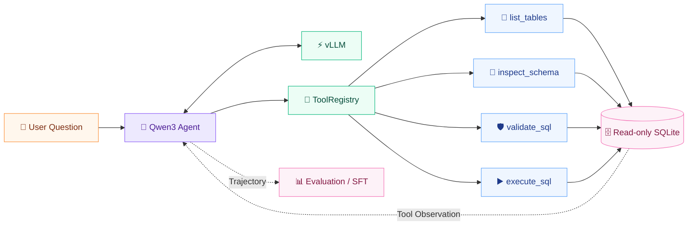

<div align="center">

<h1>🤖 ExecSQL-Agent</h1>

<p><strong>基于 Qwen3-8B + vLLM + Tool Calling 的可执行 SQL Agent</strong><br/>
支持 Schema Discovery、Execution Feedback、自纠错、离线评测与 Assistant-only QLoRA SFT</p>

<p>
  
  
  
  
  
  
</p>

<p>
  <a href="#-项目简介">项目简介</a> ·
  <a href="#-核心能力">核心能力</a> ·
  <a href="#-实验结果">实验结果</a> ·
  <a href="#-快速开始">快速开始</a> ·
  <a href="#-sft-后训练">SFT</a> ·
  <a href="#-项目结构">项目结构</a>
</p>

</div>

> ExecSQL-Agent 不只生成 SQL，而是让模型在受控工具边界内主动探索 Schema、校验并执行查询，再根据真实数据库反馈继续修复或完成回答。同一套执行事实也用于离线评测、SFT 数据构造与 RLVR verifier。

## 📌 项目简介

ExecSQL-Agent 是一个面向多数据库场景的 execution-grounded Text-to-SQL 项目。模型通过结构化 Tool Calls 逐步发现表、检查 Schema、验证 SQL 并访问只读 SQLite；执行结果或错误会作为 Tool Observation 返回上下文，驱动后续推理与修复。

项目使用 Qwen3-8B 作为基础模型，通过 vLLM 的 OpenAI-compatible API 提供推理服务。在线 Agent、工具执行、离线评测与后训练数据构造复用同一套 ToolRegistry 和 SQLite 安全边界，避免为训练或评测维护另一套数据库业务逻辑。

### 为什么要做成 Agent？

真实多数据库场景里，模型在生成 SQL 前通常并不知道数据库中有哪些表，也无法一次获得所有有效 Schema。将整个数据库 Schema 粗暴塞进 prompt，既容易超过上下文限制，也会引入大量无关字段；只做一次 SQL generation，又无法利用真实执行错误完成修复。

ExecSQL-Agent 将问题拆成一个有状态的数据库交互过程：

- **先探索，再生成**：从表发现开始，只获取当前问题相关的 Schema；
- **先校验，再执行**：复杂 SQL 可以在进入数据库前完成安全与编译检查；
- **用真实反馈修复**：字段不存在、聚合错误或 SQL syntax error 会进入后续上下文；
- **以执行结果验真**：评测关注完整结果是否等价，而不是 SQL 字符串是否相同；
- **让训练贴近运行时**：SFT 学习真实 Tool Call、Observation 与 final answer 序列，而非孤立的 Question → SQL 映射。

### 设计原则

1. **Execution-grounded**：任何数据库事实都来自可信工具和真实 SQLite。
2. **Least-context**：按需发现表和检索 Schema，避免一次注入完整数据库结构。
3. **Single source of truth**：推理、数据构造、评测和 verifier 复用同一工具实现。
4. **Oracle isolation**：Gold SQL、expected result 和 evidence 不进入 policy prompt。
5. **Reproducible evaluation**：固定 case、协议、解码与评分，仅改变待比较模型。

> [!IMPORTANT]
> 当前稳定主线为 **SQL Agent + QLoRA SFT + execution-based evaluation**。Agentic GRPO / RLVR 已具备 verifier、数据适配与 VERL diagnostic 链路，但尚未形成正式 Qwen3-8B GRPO benchmark，因此本仓库不声明 GRPO 模型效果。

## ✨ 核心能力

| 能力 | 仓库中的实现 |
|---|---|
| Dynamic Agent Loop | 原生 Tool Calling、多 Tool Call、JSON fallback 与显式终止状态 |
| Schema Discovery | `list_tables` 发现表，`inspect_schema` 按需获取字段、主键与外键 |
| SQL Validation | 单语句、只读、安全关键字与 SQLite 编译期检查 |
| Execution Feedback | 查询结果或异常以 Tool Observation 回流模型，支持多轮修复 |
| Session Context | 按 `session_id` 隔离的有限历史与任务状态关联 |
| Trajectory Logging | 记录消息、工具、SQL、执行结果、终止原因与耗时 |
| Offline Evaluation | 真实 SQLite 结果等价性评分、报告与失败类型分析 |
| QLoRA SFT | 真实 Expert Agent Trajectories + Assistant-only supervision |
| RLVR / GRPO | SQL execution verifier、VERL ToolAgentLoop 与 diagnostic reward views |

## 🔍 与常见 Text-to-SQL 方案的区别

| 能力 | 一次性 Text-to-SQL | ExecSQL-Agent |
|---|---|---|
| SQL Generation | 一次生成 | 多轮生成、执行与修复 |
| Schema Context | 预先拼接或截断 | Agent 按需调用 Schema 工具 |
| Tool Calling | 通常不是核心 | 原生 Tool Calls + JSON fallback |
| SQL Validation | 可选 | 只读安全检查 + SQLite 编译检查 |
| Database Execution | 可选 | 受限环境中的真实执行 |
| Execution Feedback | 较少参与后续推理 | Observation 回流 Agent |
| Session Context | 通常无状态 | Session ID 隔离的有界记忆 |
| Evaluation | 字符串或规则指标 | 完整执行结果集合比较 |
| Post-training | Question → SQL | 多轮 Expert Agent Trajectories |

## 🏗️ 系统架构



LLM 不直接接触数据库连接。所有调用先经过 ToolRegistry 的名称、参数和安全检查，再进入只读数据库工具层；结果以结构化 Tool Message 返回 Agent。

### 🔁 Agent 执行流程

1. 根据 `session_id` 加载有限历史，并准备 System Prompt 与工具 Schema。
2. 模型先使用 `list_tables` 发现当前未知数据库中的可用表。
3. 通过 `inspect_schema` 获取解决问题所需的字段、主键和外键。
4. 模型生成候选 SQL；复杂查询可先调用 `validate_sql`。
5. `execute_sql` 在受限只读 SQLite 连接中真实执行查询。
6. 查询结果或错误回到上下文，模型可以修复 SQL、补充 Schema 检查或完成回答。
7. 完整消息、工具调用、执行结果与终止原因写入 Trajectory。

运行时还包含 Completion Guard、重复 Tool Call 检测、重复 SQL 检测、不安全 SQL 终止与最大 Agent step 限制。

## 🧠 Context Engineering 与状态控制

SQL Agent 的效果不仅取决于模型本身，也取决于每一轮向模型提供什么上下文。项目将上下文拆成稳定指令、动态数据库信息、会话状态和工具反馈四部分：

| Context | 作用 |
|---|---|
| System Prompt | 定义只读边界、Tool Calling 协议、完成条件与禁止泄漏的信息 |
| Tool Schema | 提供四个工具的名称、参数约束与返回语义 |
| Schema Context | 先发现表，再按需检索相关表结构，减少无关列干扰 |
| Session Context | 保留最近 Query、SQL、执行摘要与最终回答，支持连续追问 |
| Tool Observation | 将真实 Schema、校验结果、查询结果或异常回填下一轮 |
| Completion State | 区分已执行、可修复、协议完成、无 final SQL 与步数耗尽 |

### Dynamic Schema Narrowing

面对未知数据库，Agent 先调用 `list_tables` 建立数据库地图，再使用 `inspect_schema` 获取当前问题需要的字段与关联关系。只有实际 Schema Observation 过大时才拆分多次 inspect，避免机械地遍历所有表。

### Completion Guard

部分模型会在真正执行 SQL 前直接给出自然语言答案。Completion Guard 会检查当前 trajectory 是否已经获得足够的数据库证据；若尚未完成执行，则追加一次结构化提醒，让模型继续使用工具。该机制只负责协议完整性，不向模型泄漏正确 SQL 或 expected result。

### 终止与防循环

Agent 会为每条 trajectory 维护工具调用与 SQL 指纹，并对以下状态显式终止或分类：

- 正常完成协议并给出 final answer；
- 达到最大 Agent steps；
- 重复相同 Tool Call；
- 重复执行相同 SQL；
- 连续产生不安全 SQL；
- 未获得可用 final SQL；
- 工具参数、解析或基础设施错误。

## 🧩 核心模块

| 模块 | 作用 | 代码入口 |
|---|---|---|
| FunctionCallingAgent | 多轮 Tool Use、Observation 回填、重复调用检测与终止控制 | [function_calling.py](src/execsql_agent/agents/function_calling.py) |
| PipelineAgent | 固定生成、验证、执行、诊断与修复基线 | [pipeline.py](src/execsql_agent/agents/pipeline.py) |
| ToolRegistry | 四个工具的定义、参数校验与分发 | [registry.py](src/execsql_agent/tools/registry.py) |
| SQLValidator | 只读单语句扫描、危险操作阻断与 SQLite 编译检查 | [sql_validator.py](src/execsql_agent/tools/sql_validator.py) |
| SQLExecutor | read-only URI、query-only、authorizer 与执行资源限制 | [sql_executor.py](src/execsql_agent/tools/sql_executor.py) |
| Session / Trajectory | 有界会话记忆与结构化轨迹持久化 | [trajectory/](src/execsql_agent/trajectory) |
| Evaluator | 结果比较、指标聚合、断点续跑与报告导出 | [evaluation/](src/execsql_agent/evaluation) |
| RLVR Verifier | 解析、验证、执行并给出可审计奖励 | [verifier.py](src/execsql_agent/rlvr/verifier.py) |

## 🛠️ 四个数据库工具

| Tool | 作用 |
|---|---|
| `list_tables` | 在未知数据库中发现可用表 |
| `inspect_schema` | 查看全部或指定表的字段、主键与外键关系 |
| `validate_sql` | 对单条只读 SQLite 查询进行静态与编译期校验 |
| `execute_sql` | 在受限只读连接中执行 SQL，并返回结构化结果或错误 |

Agent 只允许执行单条 `SELECT` / `WITH` 查询。SQL 运行时同时使用 read-only URI、`query_only`、SQLite authorizer、progress handler 与 wall-clock timeout；DDL、DML、`ATTACH` 和危险 `PRAGMA` 不会进入正常执行路径。

## 🔁 Trajectory Logging 与错误修复

每次运行都会生成结构化 Agent Trajectory，而不仅保存最终 SQL。Trajectory 包含：

- 初始 system/user messages 与完整 assistant turns；
- 每次 Tool Call 的名称、参数和对应 Tool Result；
- Schema Observation、候选 SQL、validation 与 execution 结果；
- SQL 修复前后的变化、LLM turn 与工具调用次数；
- termination reason、protocol completion、耗时与最终回答。

这些记录同时服务于三类任务：

1. **调试 Agent 行为**：定位模型是没有找到表、错误理解 Schema、生成不可执行 SQL，还是执行成功但语义不正确；
2. **离线评测与回归**：聚合工具使用、执行成功率、修复率和数据库级结果；
3. **后训练数据构建**：将通过 hard-stop 的 Expert Trajectory 转换为 Assistant-only SFT 样本。

错误分析不会只给出一个 Accuracy。Evaluator 会进一步区分 no-final-SQL、unresolved completion、execution error、semantic mismatch、max steps、repeated tool call 与 repeated SQL，使模型问题和基础设施问题可以分别定位。

## 📊 实验结果

正式 Base / SFT 对照使用从 BIRD Train 按数据库级隔离构造的 held-out evaluation split：

- **943** 个 evaluation cases；
- **7** 个训练阶段未见数据库；
- Base 与 SFT 使用相同 case 顺序、prompt、tools、decoding 和 evaluator；
- 唯一主要变量是是否加载正式 SFT LoRA Adapter。

| Metric | Qwen3-8B Base | Qwen3-8B + SFT | Change |
|---|---:|---:|---:|
| **SQL Execution Accuracy** | 23.44% (221/943) | **37.43% (353/943)** | **+14.00pp** |
| Protocol Completion | 63.84% | **81.55%** | **+17.71pp** |
| First Execution Success | 57.79% | **81.97%** | **+24.18pp** |
| Final Execution Success | 67.44% | **88.02%** | **+20.57pp** |
| no-final-SQL | 149 | **14** | **-90.6%** |

> [!NOTE]
> SFT 不仅提升最终准确率，也显著改善了 Tool Calling 协议、Schema 交互和 SQL 可执行性。训练后，剩余错误更多集中在真正困难的 SQL semantic mismatch，而不是 Agent 基础设施失败。

<details>
<summary><strong>📐 指标说明</strong></summary>

- **SQL Execution Accuracy**：预测 SQL 与 scorer-side reference SQL 分别在真实 SQLite 上执行，并比较完整结果集合是否等价。
- **Protocol Completion**：Agent 正常完成多轮工具协议，并到达有效最终状态。
- **First Execution Success**：第一次 `execute_sql` 即成功执行。
- **Final Execution Success**：trajectory 结束前存在最终成功执行结果，代表 SQL 可以执行，但不等同于语义一定正确。

</details>

> 以上结果来自项目冻结的 database-level held-out split，不是 BIRD 官方 Test leaderboard 成绩。

## 🎯 SFT 后训练

### Expert Agent Trajectories

训练数据来自 BIRD Train，并按 `database_id` 做数据库级划分：

- 61 个数据库用于训练候选池；
- 7 个完整数据库作为 held-out evaluation split；
- BIRD Mini-Dev 不参与 SFT 或 GRPO 参数更新；
- Train 与 held-out evaluation 数据库不重叠。

| Split | Expert Trajectories | Assistant-turn Samples |
|---|---:|---:|
| Train | **2,500** | **12,246** |
| Dev | **110** | **540** |

### Multi-database trajectory builder

训练编排层按 `database_id` 对样本分组，从数据库归档中按需提取对应 SQLite，调用真实 ToolRegistry 构造 trajectory，并在该数据库处理完成后清理临时文件。因此无需一次性展开完整数据库归档，也没有复制 SchemaLoader、Validator 或 Executor 逻辑。

Trajectory policy 与运行时 Agent 行为保持一致：

- 未知数据库首先调用 `list_tables`；
- 简单单表问题可使用 list → inspect → execute；
- 多表、JOIN、aggregation、nested SELECT、CTE 或 set operation 会加入 `validate_sql`；
- 仅当真实 Schema Observation 过大时拆成多次 `inspect_schema`；
- 不通过随机删除 Tool Turn 制造伪多样性。

### 数据 hard-stop

正式样本生成前必须同时满足：

- 正确解析 Gold SQL 的 physical tables，包括 alias 与 CTE；
- `gold_physical_tables` 必须是真实 `list_tables` 结果的子集；
- Gold SQL 必须在对应 SQLite 上真实执行成功；
- Schema、validation 与 execution observations 必须来自真实工具；
- Tool Call 与 Tool Result 完整配对，trajectory 非空；
- evidence、expected result、数据库路径与 scorer metadata 无泄漏；
- Gold SQL 只用于离线 teacher supervision，不进入初始 system/user message；
- chat template 后总长度不超过 4,096 tokens。

任一硬条件失败时都不会生成正式训练 JSONL。BIRD evidence 仅保留为 private metadata，不进入模型输入。

### Assistant-only supervision

每条多轮 trajectory 会展开为 Assistant-turn training samples：

| Message role | 是否参与 loss |
|---|---|
| System prompt | Masked |
| User question | Masked |
| Tool observation | Masked |
| Assistant tool call / SQL action / final answer | **Supervised** |

模型可以读取真实 Tool Observation 作为上下文，但 loss 只计算 assistant 自己应该生成的内容。

<details>
<summary><strong>⚙️ QLoRA 配置与训练结果</strong></summary>

| Configuration | Value |
|---|---|
| Base model | Qwen3-8B |
| Epoch | 1 |
| Quantization | NF4 + double quantization |
| Compute dtype | BF16 |
| LoRA | r=16, alpha=32, dropout=0.05, all-linear |
| Max length | 4,096 |
| Batch size | 1 |
| Gradient accumulation | 4 |
| Learning rate | 2e-4 |
| Optimizer | paged_adamw_8bit |
| Scheduler | cosine |
| Global steps | 3,062 |
| Training loss | 0.06396 |
| Final Dev loss | 0.04622 |
| Peak allocated VRAM | 18.39 GiB |
| Peak reserved VRAM | 30.44 GiB |

训练流程同时记录 Git revision、输入数据 SHA256、Tool Schema SHA256、基础模型信息、超参数和运行环境。模型权重与正式 LoRA Adapter 不包含在仓库中。

</details>

## 🧪 Offline Evaluation

Offline Evaluator 使用真实 SQLite 查询结果作为事实来源，而不是使用 LLM judge。预测 SQL 和 scorer-side reference SQL 分别在可信数据库上执行，再比较完整结果集合。

### Result Comparator

Comparator 支持：

- 对有序结果进行逐行比较；
- 对无序结果使用保留重复项的 multiset comparison；
- 统一处理 `NULL` 与 SQLite value types；
- 数值容差与可选严格列名检查；
- 识别截断结果、执行失败和不可可靠比较的输出。

### 评测协议与指标

除 SQL Execution Accuracy 外，系统还统计：

| Metric group | 代表指标 |
|---|---|
| Protocol | Protocol Completion、no-final-SQL、unresolved completion |
| Execution | First / Final Execution Success、execution error |
| Repair | Repair Success、修复前后 SQL 与执行状态 |
| Efficiency | Avg LLM turns、Avg tool calls、各工具使用率 |
| Stability | max steps、repeated call、repeated SQL、parser error |
| Breakdown | database-level accuracy 与 Failure Taxonomy |

Base / SFT 正式对照固定相同的 943 cases、case 顺序、system prompt、四工具 Schema、ToolRegistry、数据库解析、`max_agent_steps=6`、deterministic decoding 和 evaluator，保证唯一主要变量是模型是否加载 SFT Adapter。

评测运行支持多数据库路径解析、database fingerprint validation、scorer-side Gold Cache、checkpoint/resume、评测配置指纹，以及 JSON、CSV、Markdown 三种报告格式。

Gold SQL、expected result、database path 和 scorer metadata 始终位于私有评分侧，不会进入模型 prompt。

<details>
<summary><strong>▶️ 运行 synthetic evaluation</strong></summary>

```bash
python scripts/create_demo_database.py

python -m execsql_agent.cli evaluate \
  --agent-mode both \
  --database data/demo.db \
  --dataset data/synthetic/eval_questions.json \
  --dataset-format native \
  --output-dir outputs/synthetic
```

</details>

<details>
<summary><strong>🐦 运行 BIRD evaluation</strong></summary>

BIRD annotations 与 SQLite databases 需要从官方来源自行准备。本仓库不分发 BIRD databases、Gold SQL、private Gold Cache 或完整 benchmark outputs。

```bash
python -m execsql_agent.cli evaluate \
  --agent-mode function-calling \
  --database-root /path/to/bird/databases \
  --dataset /path/to/bird_eval.json \
  --dataset-format bird \
  --bird-gold-cache /path/to/private_gold_cache.jsonl \
  --bird-preflight-report /path/to/preflight_report.json \
  --bird-protocol-config config/bird_eval_protocol.json \
  --output-dir outputs/bird_eval \
  --real-model
```

冻结评测协议见 [config/bird_eval_protocol.json](config/bird_eval_protocol.json)。

</details>

## 🚀 Agentic RLVR / GRPO

SQL 适合使用 verifiable reward：候选 SQL 可以在可信数据库上真实执行，并与私有 expected result 比较，不需要另一个 LLM judge 判断正确性。

当前仓库已包含：

- SQL response parser 与 execution verifier；
- BIRD agentic dataset adapter；
- VERL v0.9.0 ToolAgentLoop integration；
- 每条 trajectory 的可信数据库路由；
- R1 / R2 两种 diagnostic reward view；
- Qwen3-0.6B single-step diagnostic。

| Reward view | 定义 |
|---|---|
| R1 | 结果完全等价为 1，否则为 0 |
| R2 | 结果等价为 1，可执行但错误为 0.2，其他为 0 |

> **当前没有正式 Qwen3-8B Agentic GRPO checkpoint 或 benchmark improvement claim。**

实验记录见 [Qwen3-0.6B GRPO diagnostic](docs/experiments/qwen3_0.6b_grpo_diagnostic.md)。

## 🔐 数据隔离与可复现性

仓库将公开代码、私有 benchmark 数据和实验产物严格分开：

- BIRD annotations、SQLite databases、Gold SQL 与 Gold Cache 不进入 Git；
- SFT/GRPO 正式 JSONL、Parquet、pool manifests、模型权重与 Adapter 不公开提交；
- 仓库仅保留 synthetic fixture 与 DEV-only GRPO smoke 数据；
- 模型路径、数据路径和输出目录均由 CLI 参数或环境变量提供，不依赖固定机器目录；
- 训练 manifest 记录 Git revision、输入 SHA256、Tool Schema SHA256、基础模型信息和超参数；
- evaluator 使用数据库 fingerprint 和配置 fingerprint 防止断点续跑时混用实验。

这种隔离保证 policy 看不到 oracle 信息，也使代码可以在其他机器上重新配置路径后运行。

## 🧰 技术栈

| Layer | Technology |
|---|---|
| LLM | Qwen3-8B |
| Inference | vLLM、OpenAI-compatible Chat Completions |
| Agent | Python、FunctionCallingAgent、PipelineAgent |
| Tool Calling | Native tools/tool_calls、JSON fallback、Pydantic JSON Schema |
| Database Tools | ToolRegistry、SchemaLoader、SQLValidator、SQLExecutor |
| Database | SQLite |
| Fine-tuning | PyTorch、Transformers、PEFT、bitsandbytes、QLoRA |
| RLVR | VERL v0.9.0、GRPO、ToolAgentLoop、execution verifier |
| Evaluation | Execution-result comparator、JSON/CSV/Markdown reports |
| Testing | pytest、FakeLLM、Ruff、mypy |

## ⚡ 快速开始

### 1. 安装

```bash
git clone https://github.com/zbwsth/execsql-agent.git
cd execsql-agent

python -m venv .venv

# Linux / macOS
source .venv/bin/activate

# Windows PowerShell
# .\.venv\Scripts\Activate.ps1

python -m pip install -U pip
python -m pip install -e ".[dev]"
```

### 2. 运行本地 Function Calling Demo

不需要 GPU，也不需要真实模型 API：

```bash
python scripts/create_demo_database.py

python -m execsql_agent.cli run \
  --agent-mode function-calling \
  --database data/demo.db \
  --question "查询已完成订单中消费金额最高的五位客户"
```

默认使用 deterministic FakeLLM，但 Schema 检索、SQL 校验和 SQLite 执行都是真实的。该模式用于快速验证 Agent Loop，不代表真实模型能力。

<details>
<summary><strong>🤖 连接 vLLM / OpenAI-compatible 模型服务</strong></summary>

```bash
export OPENAI_API_KEY="your-api-key"
export OPENAI_BASE_URL="http://127.0.0.1:8000/v1"
export OPENAI_MODEL="your-served-model"

python -m execsql_agent.cli run \
  --agent-mode function-calling \
  --database /path/to/database.sqlite \
  --question "统计每个地区已完成订单的总金额" \
  --llm openai \
  --max-steps 6
```

LLM client 支持请求超时、有限重试、native Tool Calling、JSON fallback 与显式关闭 Qwen thinking mode。

</details>

## 🧭 Evaluation / Training 用法

### 构建通用 SFT trajectory

```bash
python training/build_sft_dataset.py \
  --database /path/to/database.sqlite \
  --cases /path/to/cases.json \
  --split train \
  --output /path/to/train.jsonl \
  --tools-output /path/to/tools.json
```

### 检查 Assistant-only preprocessing

```bash
python training/assistant_turn_preprocessing.py \
  --model /path/to/Qwen3-8B \
  --train /path/to/train.jsonl \
  --dev /path/to/dev.jsonl
```

### 启动一轮 QLoRA SFT

```bash
python training/train_qlora_sft_full.py \
  --model /path/to/Qwen3-8B \
  --train /path/to/train.jsonl \
  --dev /path/to/dev.jsonl \
  --tools /path/to/tools.json \
  --output /path/to/new-adapter-output \
  --epochs 1 \
  --gradient-accumulation-steps 4 \
  --learning-rate 2e-4
```

核心 Agent 依赖与 GPU training dependencies 有意分离。训练环境需要自行安装与目标 CUDA 版本兼容的 PyTorch、Transformers、PEFT、bitsandbytes 和 Accelerate。

## 📁 项目结构

```text
execsql-agent/
├── src/execsql_agent/    # Agent、LLM、工具、安全执行、轨迹与评测
├── training/             # SFT/GRPO 数据构造、预处理与训练入口
├── configs/              # Runtime 与 VERL 配置
├── scripts/              # Demo、BIRD preflight、rescore 与 diagnostics
├── docs/experiments/     # 可复现实验记录
├── tests/                # CPU regression 与 contract tests
├── data/synthetic/       # 可公开的合成评测 fixture
└── data/grpo_smoke/      # DEV-only GRPO diagnostic fixture
```

以下内容不会进入 Git：BIRD 原始数据与数据库、Gold SQL、Gold Cache、正式训练 JSONL/Parquet、模型权重、LoRA Adapter、checkpoints、完整 reports 与 trajectories。

## 🗺️ Roadmap

### 已完成

- [x] Dynamic Tool Calling Agent 与 Pipeline baseline
- [x] 表发现、Schema Inspection、SQL Validation 与只读 Execution
- [x] Execution Feedback、Completion Guard 与多轮 SQL 修复
- [x] Session Memory 与 Trajectory Logging
- [x] BIRD 多数据库 Offline Evaluation
- [x] Qwen3-8B Assistant-only QLoRA SFT
- [x] SQL execution verifier 与 VERL agentic contract
- [x] Base / SFT held-out evaluation

### 计划中

- [ ] Qwen3-8B Agentic GRPO rollout 与 short-run validation
- [ ] 正式 Base / SFT / GRPO 对照评测
- [ ] 扩展更多数据库后端与更大规模独立验证

## ✅ 质量检查

```bash
pytest
ruff check .
mypy
git diff --check
```

当前公开版本：**210 passed，4 skipped，Ruff passed，mypy passed**。

测试覆盖 Tool Schema、参数校验、SQL 安全边界、多轮工具协议、Completion Guard、Session 隔离、BIRD scoring、评测续跑、Assistant-only masking、数据泄漏检查和 RLVR verifier。

## ℹ️ 项目状态与边界

- 当前数据库后端为 SQLite；
- Agent 只有 read-only access；
- CLI 当前为同步执行；
- 仓库不包含 Qwen3 权重、正式 SFT Adapter 或 BIRD 原始数据；
- 正式结果来自项目自建 database-level held-out split，不代表 BIRD 官方 Test leaderboard；
- Agentic GRPO 尚未形成正式效果结论。

---

如果你关注 **Agent 工程**，可以从 [FunctionCallingAgent](src/execsql_agent/agents/function_calling.py) 与 [ToolRegistry](src/execsql_agent/tools/registry.py) 开始；如果你关注 **后训练**，可以依次查看 [Assistant-only preprocessing](training/assistant_turn_preprocessing.py)、[SQL RLVR Verifier](src/execsql_agent/rlvr/verifier.py) 和 [GRPO diagnostic](docs/experiments/qwen3_0.6b_grpo_diagnostic.md)。

<div align="center">

### 🤖 ExecSQL-Agent

**Tool-augmented Text-to-SQL with execution feedback and verifiable training**

<sub>Generate less blindly. Execute, observe, repair and verify.</sub>

</div>
