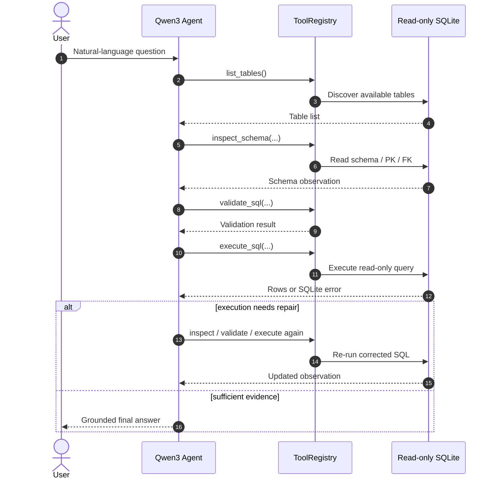
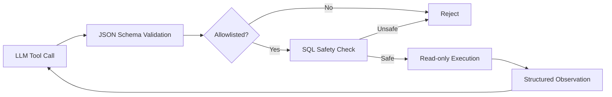
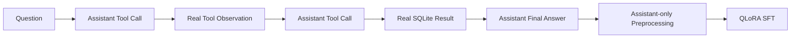
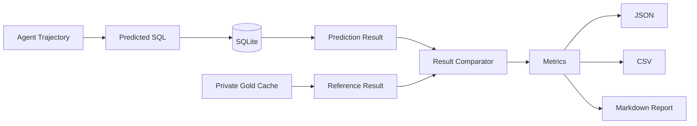

<div align="center">

# ExecSQL-Agent

### Execution-grounded Text-to-SQL Agent with Tool Calling, QLoRA SFT & Verifiable Evaluation

**让模型不只是“生成 SQL”，而是主动探索数据库、执行查询、观察反馈、修复错误，并用真实执行结果验证答案。**

`Discover → Reason → Execute → Observe → Repair → Verify`

<br>

<p>
  
  
  
  
  
  
</p>

<p>
  
  
  
</p>

<p>
  <a href="#-why-execsql-agent">Why</a> ·
  <a href="#-how-it-works">Architecture</a> ·
  <a href="#-benchmark">Benchmark</a> ·
  <a href="#-quickstart">Quickstart</a> ·
  <a href="#-training">Training</a> ·
  <a href="#-evaluation">Evaluation</a>
</p>

</div>

---

<table>
<tr>
<td align="center" width="25%">
  <strong>37.43%</strong><br>
  <sub>SQL Execution Accuracy</sub>
</td>
<td align="center" width="25%">
  <strong>+14.00pp</strong><br>
  <sub>SFT vs. Base</sub>
</td>
<td align="center" width="25%">
  <strong>943</strong><br>
  <sub>Held-out Eval Cases</sub>
</td>
<td align="center" width="25%">
  <strong>210</strong><br>
  <sub>Regression Tests</sub>
</td>
</tr>
</table>

> [!IMPORTANT]
> **当前稳定主线为 SQL Agent + QLoRA SFT + execution-based evaluation。**
>
> Agentic GRPO / RLVR 已具备 verifier、数据适配与 VERL diagnostic 链路，但尚未形成正式 Qwen3-8B GRPO benchmark，因此本仓库不声明 GRPO 模型效果。

---

## ✨ Why ExecSQL-Agent?

传统 Text-to-SQL 系统通常把任务处理成一次生成：

```text
Question → SQL
```

ExecSQL-Agent 将它建模为一个**可执行的 Agent trajectory**：

```text
Question
   ↓
Discover Schema
   ↓
Generate / Validate SQL
   ↓
Execute on Real Database
   ↓
Observe Result or Error
   ↓
Repair if Needed
   ↓
Grounded Final Answer
```

<table>
<tr>
<td width="25%" valign="top">

### 🧭 Dynamic Agent Loop

模型动态决定是否：

- `list_tables`
- `inspect_schema`
- `validate_sql`
- `execute_sql`

运行时不是固定 SQL pipeline。

</td>
<td width="25%" valign="top">

### 🛡️ Safe Execution

严格限制为只读 SQLite：

- Tool allowlist
- JSON Schema validation
- SQL safety validation
- read-only connection
- timeout / progress guard

</td>
<td width="25%" valign="top">

### 🔁 Execution Feedback

数据库反馈重新进入 Agent 上下文：

- Schema error
- SQL error
- Invalid arguments
- Execution result

模型可以继续修复，而不是一次失败即结束。

</td>
<td width="25%" valign="top">

### 🧪 Verifiable Evaluation

不是让另一个 LLM 判断 SQL 好不好。

预测 SQL 与 scorer-side reference SQL 都在真实 SQLite 上执行，并比较完整结果集合。

</td>
</tr>
</table>

核心实现：

- [`FunctionCallingAgent`](src/execsql_agent/agents/function_calling.py)
- [`ToolRegistry`](src/execsql_agent/tools/registry.py)
- [`SQLValidator`](src/execsql_agent/tools/sql_validator.py)
- [`SQLExecutor`](src/execsql_agent/tools/sql_executor.py)
- [`Evaluator`](src/execsql_agent/evaluation/evaluator.py)
- [`Metrics`](src/execsql_agent/evaluation/metrics.py)

---

## 🧠 How It Works



### Agent runtime

模型每轮接收：

```text
System Prompt
+ User Question
+ Session Context
+ Previous Tool Calls
+ Real Tool Observations
```

并动态决定下一步行动。

运行时还包含：

- native Tool Calling + JSON fallback；
- 无状态重复 Tool Call 检测；
- 重复 SQL 检测；
- 不安全 SQL 终止；
-最大 Agent step 限制；
- **Completion Guard**：模型尚未真正得到数据库证据就提前回答时，引导其继续使用工具；
- Session ID 隔离的短期多轮记忆。

---

## 🛠️ Four Structured Tools

| Tool | Purpose |
|---|---|
| `list_tables` | 在未知数据库中发现可用表 |
| `inspect_schema` | 查看字段、主键与外键 |
| `validate_sql` | 对单条只读 SQLite 查询进行静态 / 编译期校验 |
| `execute_sql` | 在受限只读 SQLite 环境中执行 SQL |

所有工具统一经过 `ToolRegistry`：



### SQL safety boundary

Agent 只能执行单条只读 `SELECT` / `WITH` 查询。

运行时同时使用：

`static validation`
→ `SQLite read-only URI`
→ `query_only`
→ `authorizer`
→ `progress handler`
→ `wall-clock timeout`

DDL、DML、`ATTACH`、危险 `PRAGMA` 等操作不会进入正常执行路径。

---

## 📊 Benchmark

正式 Base / SFT 对照实验使用从 BIRD Train 按 **database-level split** 构造的 held-out evaluation set：

<table>
<tr>
<td align="center"><strong>943</strong><br><sub>Evaluation Cases</sub></td>
<td align="center"><strong>7</strong><br><sub>Unseen Databases</sub></td>
<td align="center"><strong>Qwen3-8B</strong><br><sub>Base Model</sub></td>
<td align="center"><strong>QLoRA</strong><br><sub>SFT Adapter</sub></td>
</tr>
</table>

Base 与 SFT 使用完全相同的：

- evaluation cases 与顺序；
- system prompt；
- 四个 Tool Schema；
- ToolRegistry；
- SQLite databases；
- evaluator；
- decoding configuration。

**唯一主要变量：是否加载正式 SFT LoRA Adapter。**

### Results

| Metric | Qwen3-8B Base | Qwen3-8B + SFT | Δ |
|---|---:|---:|---:|
| **SQL Execution Accuracy** | 23.44% | **37.43%** | **+14.00pp** |
| Protocol Completion | 63.84% | **81.55%** | **+17.71pp** |
| First Execution Success | 57.79% | **81.97%** | **+24.18pp** |
| Final Execution Success | 67.44% | **88.02%** | **+20.57pp** |
| no-final-SQL | 149 | **14** | **-90.6%** |

> [!NOTE]
> **SFT 最明显的提升不仅是最终准确率。**
>
> 它同时显著改善了工具协议遵循、Schema 交互和 SQL 可执行性，使剩余错误更多集中到真正困难的 **SQL semantic mismatch**，而不是 Agent 基础设施失败。

<details>
<summary><strong>📐 Metric definitions</strong></summary>

<br>

**SQL Execution Accuracy**

预测 SQL 和 scorer-side reference SQL 分别在真实 SQLite 上执行，并比较完整结果集合是否等价。

**Protocol Completion**

Agent 正常完成多轮工具协议，并到达有效最终状态。

**First Execution Success**

第一次 `execute_sql` 即成功执行。

**Final Execution Success**

trajectory 结束前存在最终成功执行结果。它代表 SQL 可以执行，但不等同于语义一定正确。

</details>

> 以上结果来自项目冻结的 database-level held-out split，**不是 BIRD 官方 Test leaderboard 成绩**。

---

## 🔥 From Agent Trajectories to SFT

训练不是简单的：

```text
Question → Gold SQL
```

而是构造真实多轮 Agent trajectory：



训练数据中的 Schema、validation 与 execution observations 都来自真实 ToolRegistry / SQLite。

### Dataset

| Split | Expert Trajectories | Assistant-turn Samples |
|---|---:|---:|
| Train | **2,500** | **12,246** |
| Dev | **110** | **540** |

训练数据库和 held-out evaluation databases 按 `database_id` 隔离。

BIRD Mini-Dev 不参与参数更新。

### Assistant-only supervision

每条多轮 trajectory 会展开为 Assistant-turn training samples：

```text
system       → masked
user         → masked
tool result  → masked
assistant    → supervised
```

也就是说：

> 模型可以读取真实 Tool Observation 作为上下文，但 loss 只计算 assistant 自己应该产生的 Tool Call、SQL action 和 final answer。

核心实现：

- [`build_bird_sft_dataset.py`](training/build_bird_sft_dataset.py)
- [`assistant_turn_preprocessing.py`](training/assistant_turn_preprocessing.py)
- [`train_qlora_sft_full.py`](training/train_qlora_sft_full.py)

<details>
<summary><strong>⚙️ QLoRA configuration</strong></summary>

<br>

| Configuration | Value |
|---|---|
| Base model | Qwen3-8B |
| Epoch | 1 |
| Quantization | NF4 + double quantization |
| Compute dtype | BF16 |
| LoRA | r=16, alpha=32, dropout=0.05 |
| Target | all-linear |
| Max length | 4096 |
| Batch size | 1 |
| Gradient accumulation | 4 |
| Learning rate | 2e-4 |
| Optimizer | paged_adamw_8bit |
| Scheduler | cosine |
| Global steps | 3,062 |

Training run:

| Metric | Value |
|---|---:|
| Training loss | `0.06396` |
| Final Dev loss | `0.04622` |
| Peak allocated VRAM | `18.39 GiB` |
| Peak reserved VRAM | `30.44 GiB` |

训练流程同时记录 Git revision、输入数据 SHA256、Tool Schema SHA256、基础模型信息、超参数和运行环境，以便追踪实验来源。

模型权重和 LoRA Adapter 不包含在本仓库中。

</details>

---

## ⚡ Quickstart

### 1. Install

```bash
git clone https://github.com/zbwsth/execsql-agent.git
cd execsql-agent

python -m venv .venv
source .venv/bin/activate

python -m pip install -U pip
python -m pip install -e ".[dev]"
```

要求：

```text
Python >= 3.11
SQLite
```

### 2. Run the deterministic demo

不需要 GPU，也不需要真实模型 API：

```bash
python scripts/create_demo_database.py

python -m execsql_agent.cli run \
  --agent-mode function-calling \
  --database data/demo.db \
  --question "查询已完成订单中消费金额最高的五位客户"
```

该模式使用 deterministic FakeLLM，用于快速验证：

`Agent Loop`
→ `Tool Calling`
→ `Execution Feedback`
→ `SQL Repair`
→ `Trajectory Logging`

它用于系统回归测试，**不代表真实模型能力**。

<details>
<summary><strong>🤖 Connect to vLLM / OpenAI-compatible inference</strong></summary>

<br>

```bash
export OPENAI_API_KEY="your-api-key"
export OPENAI_BASE_URL="http://127.0.0.1:8000/v1"
export OPENAI_MODEL="your-served-model"

python -m execsql_agent.cli run \
  --agent-mode function-calling \
  --database /path/to/database.sqlite \
  --question "统计每个地区已完成订单的总金额" \
  --llm openai \
  --max-steps 6
```

LLM client 支持：

- request timeout；
- bounded retry；
- native Tool Calling；
- JSON fallback；
- 显式关闭 Qwen thinking mode。

</details>

---

## 🧪 Evaluation

离线 evaluator 直接消费完整 Agent trajectory。



Gold SQL、expected result、database path 与 scorer metadata 均位于 **private scorer side**，不会注入模型 prompt。

Evaluator 支持：

- real SQLite result-based scoring；
- 多数据库路径解析；
- database fingerprint validation；
- Gold Cache；
- checkpoint / resume；
- evaluation configuration fingerprint；
- failure taxonomy；
- database-level statistics；
- tool usage statistics；
- JSON / CSV / Markdown reports。

<details>
<summary><strong>▶️ Run synthetic evaluation</strong></summary>

<br>

```bash
python scripts/create_demo_database.py

python -m execsql_agent.cli evaluate \
  --agent-mode both \
  --database data/demo.db \
  --dataset data/synthetic/eval_questions.json \
  --dataset-format native \
  --output-dir outputs/synthetic
```

</details>

<details>
<summary><strong>🐦 Run BIRD evaluation</strong></summary>

<br>

BIRD annotations 和 SQLite databases 需要从官方来源自行准备。

本仓库不分发：

- BIRD databases；
- Gold SQL；
- private Gold Cache；
-完整 benchmark outputs。

```bash
python -m execsql_agent.cli evaluate \
  --agent-mode function-calling \
  --database-root /path/to/bird/databases \
  --dataset /path/to/bird_eval.json \
  --dataset-format bird \
  --bird-gold-cache /path/to/private_gold_cache.jsonl \
  --bird-preflight-report /path/to/preflight_report.json \
  --bird-protocol-config config/bird_eval_protocol.json \
  --output-dir outputs/bird_eval \
  --real-model
```

冻结评测协议：

[`config/bird_eval_protocol.json`](config/bird_eval_protocol.json)

</details>

---

## 🎯 Training

### Generic SFT trajectory builder

```bash
python training/build_sft_dataset.py \
  --database /path/to/database.sqlite \
  --cases /path/to/cases.json \
  --split train \
  --output /path/to/train.jsonl \
  --tools-output /path/to/tools.json
```

### Validate assistant-only preprocessing

```bash
python training/assistant_turn_preprocessing.py \
  --model /path/to/Qwen3-8B \
  --train /path/to/train.jsonl \
  --dev /path/to/dev.jsonl
```

### QLoRA SFT

```bash
python training/train_qlora_sft_full.py \
  --model /path/to/Qwen3-8B \
  --train /path/to/train.jsonl \
  --dev /path/to/dev.jsonl \
  --tools /path/to/tools.json \
  --output /path/to/new-adapter-output \
  --epochs 1 \
  --gradient-accumulation-steps 4 \
  --learning-rate 2e-4
```

> Core Agent dependencies 与 GPU training dependencies 有意分离。训练环境需要自行安装与目标 CUDA 版本兼容的 PyTorch、Transformers、PEFT、bitsandbytes 和 Accelerate。

---

## 🧬 Agentic RLVR / GRPO

Agentic RLVR 是当前实验分支，而不是仓库已经完成的模型效果结论。

已有组件包括：

```text
Agent rollout
     ↓
Tool interaction
     ↓
SQLite execution
     ↓
Execution Verifier
     ↓
Reward
     ↓
VERL / GRPO
```

仓库已经包含：

- SQL response parser；
- execution verifier；
- BIRD agentic dataset adapter；
- VERL ToolAgentLoop integration；
- execution-based reward；
- Qwen3-0.6B single-step diagnostic。

Reward prototype：

```text
R1
exact result equivalence → 1
otherwise                → 0

R2
exact result equivalence → 1.0
executable but incorrect → 0.2
otherwise                → 0.0
```

目前 **没有正式 Qwen3-8B Agentic GRPO checkpoint 或 benchmark improvement claim**。

Diagnostic：

[`docs/experiments/qwen3_0.6b_grpo_diagnostic.md`](docs/experiments/qwen3_0.6b_grpo_diagnostic.md)

---

## 📦 Repository Structure

<details open>
<summary><strong>Project tree</strong></summary>

<br>

```text
execsql-agent/
│
├── src/execsql_agent/
│   ├── agents/
│   │   ├── function_calling.py   # Dynamic Tool Calling Agent
│   │   └── pipeline.py           # Deterministic pipeline baseline
│   │
│   ├── tools/
│   │   ├── registry.py           # Tool definitions + validation + dispatch
│   │   ├── schema_loader.py      # SQLite schema discovery
│   │   ├── sql_validator.py      # Read-only SQL safety validation
│   │   └── sql_executor.py       # Bounded SQLite execution
│   │
│   ├── evaluation/
│   │   ├── evaluator.py          # Offline evaluation orchestration
│   │   ├── comparator.py         # Result equivalence
│   │   ├── metrics.py            # Metric aggregation
│   │   └── reports.py            # JSON / CSV / Markdown reports
│   │
│   ├── trajectory/
│   │   ├── logger.py             # Structured trajectory logging
│   │   └── memory.py             # Session memory
│   │
│   └── rlvr/
│       ├── response_parser.py
│       └── verifier.py
│
├── training/
│   ├── build_bird_sft_dataset.py
│   ├── assistant_turn_preprocessing.py
│   ├── train_qlora_sft_full.py
│   ├── build_bird_grpo_agentic_dataset.py
│   └── verl_*.py
│
├── scripts/
├── config/
├── configs/
├── docs/
├── tests/
└── data/
```

</details>

---

## ✅ Quality

```bash
pytest
ruff check .
mypy
git diff --check
```

当前公开版本：

```text
210 passed
4 skipped
Ruff: passed
mypy: passed
```

测试覆盖：

`Tool Schema`
· `argument validation`
· `SQL safety`
· `multi-turn tool protocol`
· `Completion Guard`
· `session isolation`
· `BIRD scoring`
· `evaluation resume`
· `assistant-only masking`
· `data leakage checks`
· `RLVR verifier`

---

## ⚠️ Scope & Limitations

当前版本明确限定：

- 数据库后端为 **SQLite**；
- Agent 对数据库只有 **read-only access**；
- CLI 当前为同步执行；
- 本仓库不包含 Qwen3 权重或正式 SFT Adapter；
- 不包含 BIRD 原始数据、Gold SQL 或 private Gold Cache；
- benchmark 来自项目冻结的 database-level held-out split；
- 不将该结果描述为 BIRD 官方 Test leaderboard；
- Agentic GRPO 仍处于实验阶段。

---

## 🙏 Acknowledgements

ExecSQL-Agent builds on the open-source ecosystem around:

**Qwen3 · vLLM · BIRD · Transformers · PEFT · bitsandbytes · VERL**

---

<div align="center">

### ExecSQL-Agent

**Tool-augmented Text-to-SQL with execution feedback and verifiable training.**

<sub>Generate less blindly. Execute, observe, repair and verify.</sub>

<br><br>

<a href="#execsql-agent">Back to top ↑</a>

</div>
