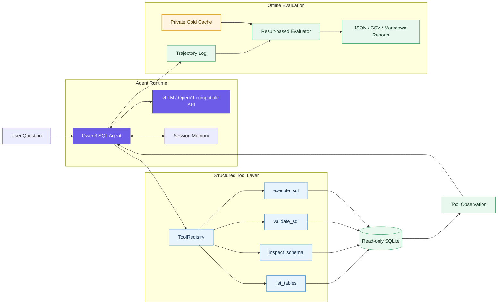

<div align="center">

<h1>ExecSQL-Agent</h1>

<p><strong>基于 Qwen3-8B、vLLM 与 Tool Calling 的多数据库 Text-to-SQL Agent</strong></p>

<p>以真实数据库执行反馈驱动 Schema Discovery、SQL Validation、错误修复与后训练评测</p>

<p>
  
  
  
  
  
  
</p>

<p>
  <a href="#项目简介">项目简介</a> ·
  <a href="#核心能力">核心能力</a> ·
  <a href="#系统架构">系统架构</a> ·
  <a href="#base-vs-sft-实验结果">实验结果</a> ·
  <a href="#快速开始">快速开始</a> ·
  <a href="#sft-pipeline">SFT Pipeline</a>
</p>

</div>

---

> [!IMPORTANT]
> **当前状态：SQL Agent 与 QLoRA SFT 主线已经完成。**
>
> 四工具调用链、只读 SQLite 执行、BIRD 多数据库评测与 Assistant-only SFT 已完成；Agentic GRPO / RLVR 仍处于实验阶段，当前仓库不声明正式 GRPO 模型效果。

<table>
  <tr>
    <td align="center"><strong>4</strong><br><sub>结构化数据库工具</sub></td>
    <td align="center"><strong>2,500</strong><br><sub>Expert Agent Trajectories</sub></td>
    <td align="center"><strong>943</strong><br><sub>Held-out Evaluation Cases</sub></td>
    <td align="center"><strong>+14.00pp</strong><br><sub>SQL Execution Accuracy</sub></td>
  </tr>
</table>

<details>
<summary><strong>浏览完整目录</strong></summary>

- [项目简介](#项目简介)
- [核心能力](#核心能力)
- [系统架构](#系统架构)
- [SFT 数据与训练](#sft-数据与训练)
- [Base vs SFT 实验结果](#base-vs-sft-实验结果)
- [快速开始](#快速开始)
- [运行离线评测](#运行离线评测)
- [SFT Pipeline](#sft-pipeline)
- [GRPO / RLVR 状态](#grpo--rlvr-状态)
- [项目结构](#项目结构)
- [质量检查](#质量检查)
- [当前边界](#当前边界)

</details>

## 项目简介

ExecSQL-Agent 不是一次性生成 SQL 的 Text-to-SQL 脚本，而是一个以真实数据库执行结果为反馈的多轮 SQL Agent。模型通过结构化工具调用逐步发现表、检索 Schema、校验 SQL 并执行查询，再根据 Tool Observation 完成回答或修复错误。

```text
Question
  → list_tables
  → inspect_schema
  → SQL generation
  → validate_sql / execute_sql
  → Execution Feedback
  → repair or final answer
```

项目使用 Qwen3-8B 作为基础模型，通过 vLLM 的 OpenAI-compatible API 提供推理服务。Agent、工具执行、评测、SFT 数据构造和 RLVR verifier 共享同一套 ToolRegistry 与 SQLite 执行边界，避免为训练或评测复制另一套数据库业务逻辑。

## 核心能力

### 1. Dynamic Tool Calling Agent

- 支持原生 Tool Calling，同时提供 JSON tool-call fallback。
- 支持多轮、多工具调用以及 Tool Observation 回填。
- 根据数据库与问题动态决定工具路径，不把运行时 Agent 固定为单一流水线。
- 检测无状态重复工具调用、重复 SQL、连续不安全 SQL 和最大步数终止。
- 当模型在尚未执行 SQL 时提前作答，通过一次性 Completion Guard 引导其继续完成数据库交互。
- 使用 Session ID 隔离并维护最近多轮 Query、SQL、工具调用、执行摘要和最终回答。

### 2. 数据库工具体系

所有模型可见工具都由 `ToolRegistry` 提供严格 JSON Schema、参数校验和统一调度。

| Tool | 作用 |
|---|---|
| `list_tables` | 发现当前数据库中的可用表，适用于未知数据库 |
| `inspect_schema` | 查看全部或指定表的字段、主键与外键关系 |
| `validate_sql` | 对单条只读 SQLite 查询进行静态与编译期校验 |
| `execute_sql` | 在受限只读连接中执行 SQL，并返回结构化结果或错误 |

SQL 执行边界包括：

- 仅允许单条 `SELECT` / `WITH` 查询；
- 阻止 DDL、DML、`ATTACH`、`PRAGMA` 等写入或越权操作；
- 使用 SQLite read-only URI、`query_only` 和 authorizer；
- 对 Agent Observation 限制返回行数，对离线评分使用完整结果；
- 使用 progress handler 和 wall-clock timeout 控制异常查询；
- 不安全 SQL 不会进入 SQLite 执行阶段。

### 3. Execution Feedback 与反思修复

执行结果、SQLite 异常和工具参数错误会作为 Observation 回传给模型。Agent 可以据此重新检查 Schema、修复表名或字段、调整 SQL 并再次执行。

系统分别记录：

- 首次执行是否成功；
- 最终执行是否成功；
- 是否发生有效修复；
- 是否重复调用或重复 SQL；
- 是否正常完成协议；
- 最终结果是否与参考结果等价。

因此，“SQL 可以执行”与“SQL 语义正确”不会被混为同一个指标。

### 4. Trajectory Logging 与 Offline Evaluation

每次运行都会形成结构化 Agent Trajectory，记录：

- 模型消息与 Tool Call；
- Tool Observation 与参数校验结果；
- 候选 SQL、最终 SQL 和 SQLite 执行结果；
- 修复过程、终止原因与耗时；
- LLM turn、工具调用和 SQL 执行次数。

离线评测支持：

- 真实 SQLite result-based scoring；
- 多数据库路径解析与数据库指纹校验；
- scorer-side Gold Cache，参考结果不进入模型上下文；
- Base / SFT 使用同一 case 顺序、提示词、工具、解码和评分协议；
- checkpoint/resume 与配置指纹检查；
- JSON、CSV、Markdown 三种报告；
- 数据库维度分析、工具使用统计和 Failure Taxonomy。

## 系统架构



Gold SQL、expected result、数据库路径和 scorer metadata 均位于私有评分侧，不会注入 Agent 的 system/user prompt。

## SFT 数据与训练

### 数据隔离

训练数据基于 BIRD Train 构建，并按 `database_id` 进行数据库级划分，而不是对问题随机切分：

- 61 个数据库用于训练数据候选池；
- 7 个完整数据库作为 held-out evaluation split；
- 训练数据库与 held-out 数据库不重叠；
- BIRD Mini-Dev 不参与 SFT 或 GRPO 参数更新。

最终构造：

| Split | Expert Trajectories | Assistant-turn samples |
|---|---:|---:|
| Train | 2,500 | 12,246 |
| Dev | 110 | 540 |

每条 Expert Agent Trajectory 的 Schema、validation 和 execution observation 均来自真实 ToolRegistry 与 SQLite：

```text
system + question
  → assistant tool_call
  → real tool observation
  → ...
  → assistant final answer
```

数据构造包含以下 hard-stop：

- Gold SQL 的物理表必须存在于真实 `list_tables` 结果；
- Gold SQL 必须能够在对应 SQLite 数据库真实执行；
- Tool Call 与 Tool Result 必须完整配对；
- 禁止 evidence、expected result、数据库路径和 scorer metadata 泄漏；
- Gold SQL 仅作为 assistant SQL action 的离线监督目标，不写入初始 system/user 消息或伪造的 tool observation；
- 单条序列不得超过 4,096 tokens；
- 任一硬条件失败时不生成最终训练 JSONL。

### Assistant-only supervision

预处理会把一条多轮 trajectory 展开为多个 Assistant-turn 样本：

- user、system 和 tool observation tokens 全部 mask；
- assistant tool-call、SQL action 与 final-answer tokens 参与 loss；
- 后续 assistant turn 可以读取此前真实工具结果，但这些上下文 token 不参与监督损失。

### QLoRA 配置

正式 SFT 使用 Transformers、PEFT 与 bitsandbytes 对 Qwen3-8B 进行 4-bit QLoRA：

| 配置 | 数值 |
|---|---|
| Epoch | 1 |
| Quantization | NF4 + double quantization |
| Compute dtype | BF16 |
| LoRA | r=16, alpha=32, dropout=0.05, all-linear |
| Max length | 4,096 |
| Batch size | 1 |
| Gradient accumulation | 4 |
| Learning rate | 2e-4 |
| Optimizer | paged_adamw_8bit |
| Scheduler | cosine |
| Global steps | 3,062 |

正式训练结果：

- Training loss：`0.06396`
- Final Dev loss：`0.04622`
- Peak allocated VRAM：`18.39 GiB`
- Peak reserved VRAM：`30.44 GiB`

训练脚本会记录 Git revision、输入文件 SHA256、Tool Schema SHA256、基础模型指纹、超参数和运行环境，便于追踪模型来源。模型权重和 Adapter 不包含在本仓库中。

## Base vs SFT 实验结果

正式对照使用从 BIRD Train 按数据库级隔离得到的 held-out evaluation split，共 **943 个样本、7 个训练阶段未见数据库**。

Base 与 SFT 保持完全相同的：

- case 集合与顺序；
- system prompt 与四工具 Schema；
- ToolRegistry、数据库解析和 evaluator；
- `max_agent_steps=6`；
- `temperature=0`、`top_p=1`、`seed=0`；
- `enable_thinking=false`；
- 不向模型提供 BIRD evidence、Gold SQL 或 expected result。

唯一变量是是否加载正式 SFT LoRA Adapter。

> [!NOTE]
> **核心结果：** SFT 将 SQL Execution Accuracy 从 **23.44%** 提升至 **37.43%**，并将无法产出最终 SQL 的 case 从 **149** 降至 **14**。

| Metric | Qwen3-8B Base | Qwen3-8B + SFT | Change |
|---|---:|---:|---:|
| SQL Execution Accuracy | 23.44% (221/943) | **37.43% (353/943)** | **+14.00pp** |
| Protocol Completion | 63.84% | **81.55%** | **+17.71pp** |
| First Execution Success | 57.79% | **81.97%** | **+24.18pp** |
| Final Execution Success | 67.44% | **88.02%** | **+20.57pp** |
| no-final-SQL | 149 | **14** | **-90.6%** |

<details>
<summary><strong>查看指标定义</strong></summary>

- **SQL Execution Accuracy**：预测 SQL 与 scorer-side 参考 SQL 在真实 SQLite 上的完整结果集合等价。
- **Protocol Completion**：Agent 正常结束多轮工具协议并给出最终回答。
- **First Execution Success**：第一次 `execute_sql` 即成功执行。
- **Final Execution Success**：trajectory 结束前至少保留了一次最终成功执行结果，不代表语义一定正确。

</details>

结果表明，SFT 显著改善了工具协议学习、Schema 交互和 SQL 可执行性；当前主要剩余错误已由基础设施失败转向 SQL semantic mismatch。

> 该结果来自项目冻结的数据库级 held-out split，不等同于 BIRD 官方 Test leaderboard 成绩。

## 快速开始

> [!TIP]
> 本地 deterministic demo 和完整 CPU 测试均不需要 GPU；只有真实模型推理与 QLoRA 训练需要单独准备对应运行环境。

### 环境要求

- Python 3.11+
- SQLite
- 运行真实模型时需要 OpenAI-compatible 推理服务
- 本地 deterministic demo 与单元测试不需要 GPU

```bash
git clone https://github.com/zbwsth/execsql-agent.git
cd execsql-agent

python -m venv .venv
source .venv/bin/activate
python -m pip install -U pip
python -m pip install -e ".[dev]"
```

### 运行 deterministic demo

```bash
python scripts/create_demo_database.py

python -m execsql_agent.cli run \
  --agent-mode function-calling \
  --database data/demo.db \
  --question "查询已完成订单中消费金额最高的五位客户"
```

默认使用可复现的 FakeLLM 响应，适合验证 Agent Loop、错误回填、SQL 修复和 trajectory logging，不代表真实模型能力。

### 接入 vLLM / OpenAI-compatible 服务

```bash
export OPENAI_API_KEY="your-api-key"
export OPENAI_BASE_URL="http://127.0.0.1:8000/v1"
export OPENAI_MODEL="your-served-model"

python -m execsql_agent.cli run \
  --agent-mode function-calling \
  --database /path/to/database.sqlite \
  --question "统计每个地区已完成订单的总金额" \
  --llm openai \
  --max-steps 6
```

LLM client 支持请求超时、有限重试、native tool calling、JSON fallback，以及显式关闭 Qwen thinking mode。

## 运行离线评测

合成数据评测不依赖 BIRD：

```bash
python scripts/create_demo_database.py

python -m execsql_agent.cli evaluate \
  --agent-mode both \
  --database data/demo.db \
  --dataset data/synthetic/eval_questions.json \
  --dataset-format native \
  --output-dir outputs/synthetic
```

BIRD 多数据库评测需要用户从官方来源自行准备 annotations 与 SQLite databases。本仓库不分发 BIRD 数据、Gold SQL、Gold Cache 或数据库文件。

```bash
python -m execsql_agent.cli evaluate \
  --agent-mode function-calling \
  --database-root /path/to/bird/databases \
  --dataset /path/to/bird_eval.json \
  --dataset-format bird \
  --bird-gold-cache /path/to/private_gold_cache.jsonl \
  --bird-preflight-report /path/to/preflight_report.json \
  --bird-protocol-config config/bird_eval_protocol.json \
  --output-dir outputs/bird_eval \
  --real-model
```

## SFT Pipeline

通用 trajectory builder 使用显式数据库、case spec 与输出路径，不依赖某个固定 benchmark：

```bash
python training/build_sft_dataset.py \
  --database /path/to/database.sqlite \
  --cases /path/to/cases.json \
  --split train \
  --output /path/to/train.jsonl \
  --tools-output /path/to/tools.json
```

检查 Assistant-only preprocessing：

```bash
python training/assistant_turn_preprocessing.py \
  --model /path/to/Qwen3-8B \
  --train /path/to/train.jsonl \
  --dev /path/to/dev.jsonl
```

启动一轮 QLoRA SFT：

```bash
python training/train_qlora_sft_full.py \
  --model /path/to/Qwen3-8B \
  --train /path/to/train.jsonl \
  --dev /path/to/dev.jsonl \
  --tools /path/to/tools.json \
  --output /path/to/new-adapter-output \
  --epochs 1 \
  --gradient-accumulation-steps 4 \
  --learning-rate 2e-4
```

核心 Agent 依赖与 GPU 训练依赖有意分离。运行训练脚本前需在独立环境中安装与目标 CUDA 兼容的 PyTorch、Transformers、PEFT、bitsandbytes 和 Accelerate。

## GRPO / RLVR 状态

仓库包含 SQL execution verifier 与 VERL diagnostic 代码。已有 Qwen3-0.6B 单步 diagnostic 验证过 rollout、reward、group-relative advantage、backward 和 optimizer step 的基本链路，但它不是模型效果实验。

面向 Qwen3-8B + SFT Adapter 的 Agentic GRPO 仍处于实验阶段，目标是复用相同的多轮工具协议与真实 SQLite verifier：

- VERL `ToolAgentLoop`；
- 每条 trajectory 独立路由可信数据库；
- Tool Observation 进入后续上下文但不计算 policy loss；
- expected result 仅存在于 private verifier metadata；
- R1：结果完全等价为 1，否则为 0；
- R2：结果等价为 1、可执行但错误为 0.2、其他为 0。

当前没有正式 Agentic GRPO checkpoint 或 benchmark 提升结果。

## 项目结构

```text
execsql-agent/
├── src/execsql_agent/
│   ├── agents/          # Pipeline baseline 与 Tool Calling Agent
│   ├── llm/             # FakeLLM 与 OpenAI-compatible client
│   ├── tools/           # ToolRegistry、Schema、Validator、Executor
│   ├── evaluation/      # Dataset adapter、scorer、metrics、reports
│   ├── trajectory/      # JSONL logging 与 Session Memory
│   └── rlvr/            # SQL response parser 与 execution verifier
├── training/            # SFT/GRPO 数据构造、预处理与训练入口
├── scripts/             # Demo、BIRD preflight、rescore 与 diagnostics
├── config/              # 冻结评测协议
├── configs/             # Runtime / VERL 配置
├── tests/               # CPU regression 与 contract tests
├── data/synthetic/      # 可公开的合成评测 fixture
└── data/grpo_smoke/     # DEV-only GRPO diagnostic fixture
```

以下内容只应保存在本地，不应提交到 Git：

- BIRD 原始 annotations、databases、Gold SQL 与 Gold Cache；
- SFT/GRPO JSONL、Parquet 和 pool manifests；
- 模型权重、LoRA Adapter、checkpoints；
- 完整 evaluation reports、trajectories 和运行日志。

## 质量检查

```bash
pytest
ruff check .
mypy
git diff --check
```

测试覆盖 Tool Schema、参数校验、SQL 安全边界、多轮工具消息、Completion Guard、Session 隔离、BIRD result scoring、评测续跑、Assistant-only masking、数据泄漏检查和 RLVR verifier。

## 当前边界

- 当前数据库后端为 SQLite。
- CLI 为同步执行，不包含 FastAPI 服务。
- Agent 对外只允许只读 SQL。
- 本仓库不包含 Qwen3 权重、正式 SFT Adapter 或 BIRD 数据。
- 正式结果来自项目自建的数据库级 held-out split，不冒充官方 Test leaderboard。
- GRPO 尚未形成正式效果结论。

## Acknowledgements

本项目基于 Qwen3、vLLM、BIRD、Transformers、PEFT、bitsandbytes 与 VERL 等开源项目构建。

---

<p align="center">
  <sub>ExecSQL-Agent · Tool-augmented Text-to-SQL with execution feedback</sub>
</p>

<p align="right"><a href="#execsql-agent">返回顶部 ↑</a></p>
